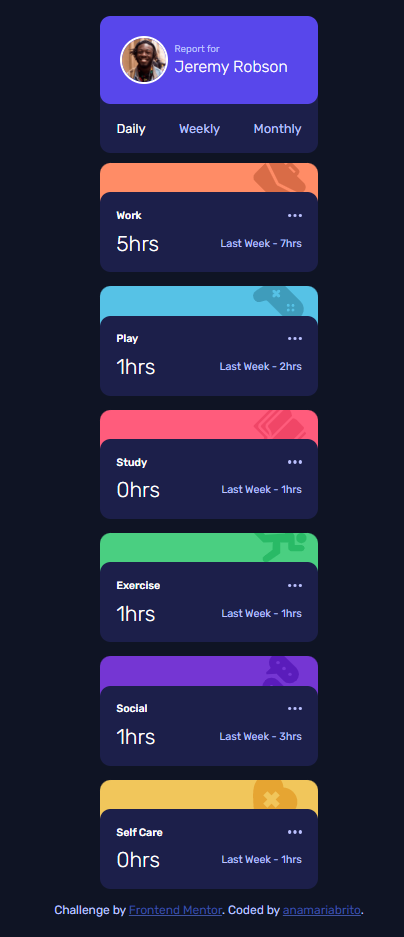

# Frontend Mentor 

# Sobre o projeto 

Este projeto consiste em um painel de gerenciamento de tempo. Nele, é possível verificar quanto tempo o usuário dedicou para suas atividades, de forma diária, semanal e mensal. 
O projeto é um desafiado criado pela plataforma Frontend Mentor: https://www.frontendmentor.io/

<h5>Versão Mobile<h5>

<h5>Versão Desktop<h5>

